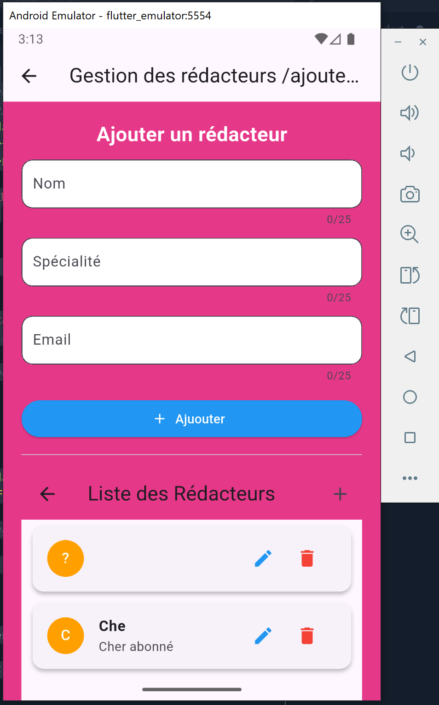
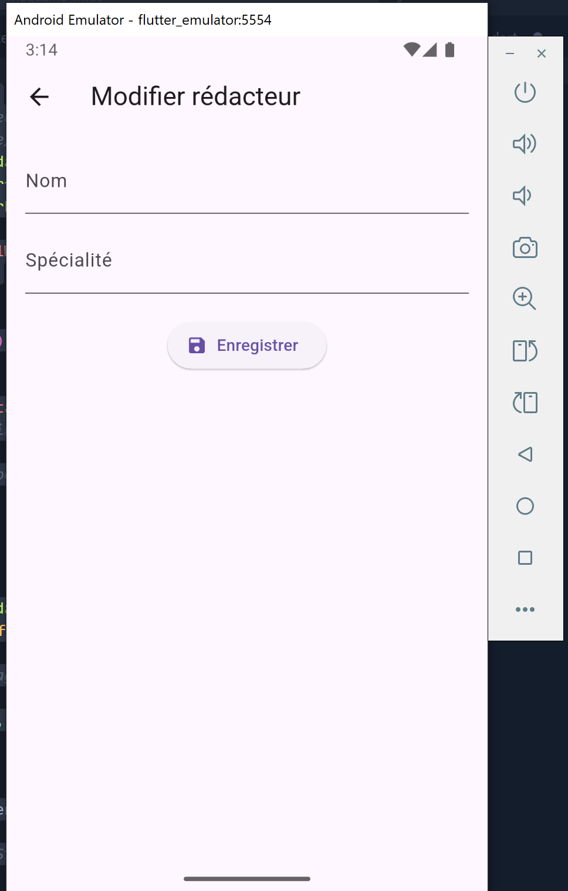
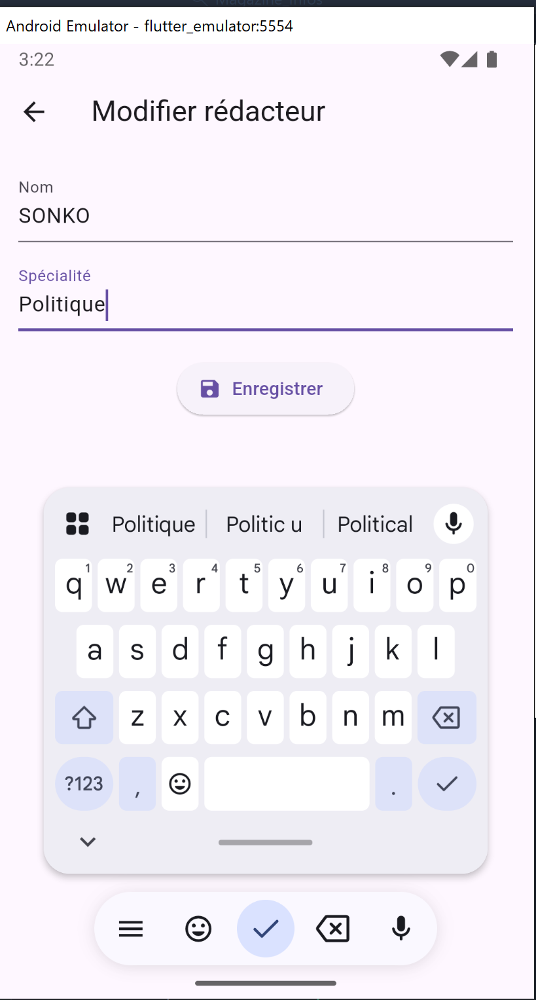
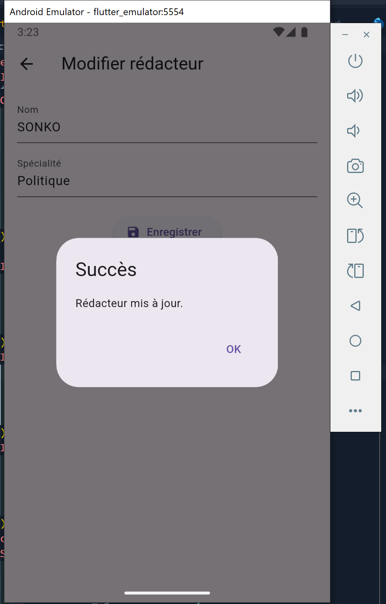
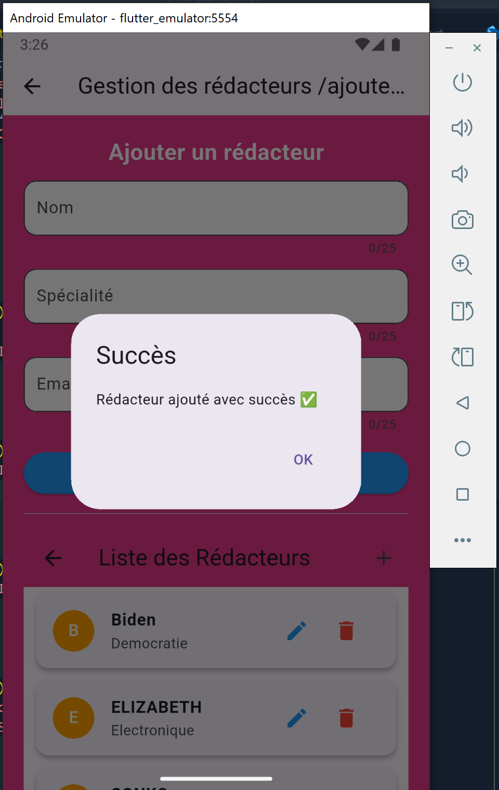
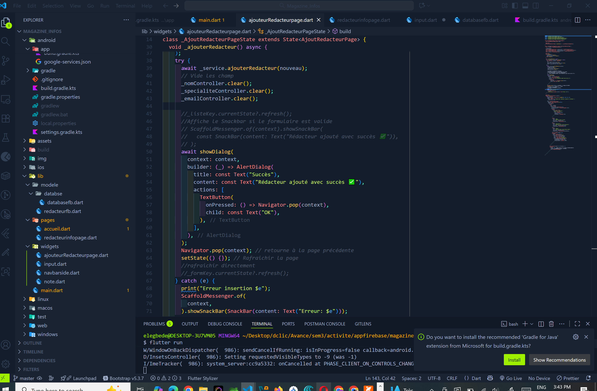

# Magazine Infos

Magazine Infos est une application / plateforme numérique conçue pour diffuser des informations variées, accessibles et actualisées. Elle propose des articles, actualités, analyses et rubriques thématiques (politique, économie, technologie, culture, sport, etc.) afin de tenir les utilisateurs informés en temps réel. 

**Magazine Infos** est une application mobile Flutter connectée à **Firebase Firestore**, permettant la **gestion complète des rédacteurs** d’un magazine numérique.  
Cette application s’inscrit dans le cadre de l’**activité 3** du module Flutter avancé : *Gestion des rédacteurs pour Magazine Infos*.

Elle reprend l’application *Magazine Infos* existante (niveau intermédiaire) et lui ajoute une **nouvelle fonctionnalité Firebase** pour la gestion dynamique des rédacteurs (CRUD complet).

L’objectif est d’offrir :

- une interface simple et intuitive pour consulter l’information,

- un accès rapide aux actualités locales et internationales,

- une organisation claire par catégories pour faciliter la lecture,

- une expérience interactive et moderne adaptée au numérique.

# Aperçu 


<p align="center">
  
  
  
  
  
  
  
  
</p>

> *Aperçu rapide de l’interface principale, du menu et des écrans clés de l’application.*

 


## 🎯 Objectifs pédagogiques

Ce projet vise à renforcer vos compétences en :
- 🔥 Création et configuration d’un projet **Firebase** ;
- 🗄️ Utilisation de **Firestore Database** pour stocker les données en temps réel ;
- 📱 Configuration de **Firebase dans Flutter (Android)** ;
- ✏️ Réalisation des opérations **CRUD** (Create, Read, Update, Delete) ;
- 🎨 Conception d’interfaces utilisateur modernes avec **Widgets Flutter**.


## 🚀 Fonctionnalités principales

### 🏠 Page d’Accueil
- Affiche le **titre du magazine**, une **image de couverture**, et une **brève description**.  
- Dispose d’un **menu de navigation (Drawer)** vers les autres pages de l’application.

### ➕ Ajouter un Rédacteur
- Formulaire de saisie avec **validation** pour le nom et la spécialité.  
- Envoi des données vers **Firebase Firestore**.  
- Affichage d’un **dialogue de confirmation** après ajout.

### 📋 Informations des Rédacteurs
- Affichage dynamique de la **liste des rédacteurs** stockés dans Firestore.  
- Rafraîchissement automatique via **StreamBuilder**.  
- Icônes pour **modifier** ou **supprimer** un rédacteur.

### 📝 Modifier un Rédacteur
- Page pré-remplie avec les informations actuelles du rédacteur.  
- Possibilité de **mettre à jour les champs** et de sauvegarder les modifications.  
- Confirmation après mise à jour réussie.

### 🗑️ Supprimer un Rédacteur
- Page de **confirmation de suppression**.  
- Suppression du document correspondant dans Firestore.  
- Message de succès après suppression.

---

### 🛠️ Technologies utilisées

| Catégorie            | Technologie              |
| -------------------- | ------------------------ |
| Framework mobile     | Flutter                  |
| Langage              | Dart                     |
| Backend as a Service | Firebase                 |
| Base de données      | Cloud Firestore          |
| IDE recommandé       | Android Studio / VS Code |

---
### 1️⃣ Prérequis

- Flutter SDK (≥ 3.x)
- Compte [Firebase](https://console.firebase.google.com/)
- Android Studio ou VS Code avec extensions Flutter
- Un appareil ou émulateur Android

--- 
dependencies:
| Dépendance              | Utilité                                   |
| ----------------------- | ----------------------------------------- |
| `firebase_core`         | Initialisation de Firebase dans Flutter   |
| `cloud_firestore`       | Gestion des données dans Firestore        |
| `flutter/material.dart` | Widgets et design UI                      |
| `cupertino_icons`       | Icônes iOS                                |


  📸 Illustration du flux utilisateur

Voici une représentation simplifiée du **flux de navigation** dans l’application :

```

A[🏁 Lancement de l'application] --> B[🏠 Page d'accueil]
B -->|Menu Drawer| C[Gestion des rédacteurs]
B -->|Menu Drawer| D[📋 Liste des rédacteurs]

C --> E[🧾 Saisie du nom et spécialité]
E --> F[💾 Enregistrement dans Firestore]
F --> G[✅ Boîte de dialogue de succès]
G --> D

D --> H[👁️ Affichage dynamique (StreamBuilder)]
H --> I[✏️ Modifier rédacteur]
H --> J[🗑️ Supprimer rédacteur]
I --> K[💾 Mise à jour Firestore + succès]
J --> L[❌ Suppression confirmée]
K --> D
L --> D


## ⚙️ Installation & Exécution

### 1️⃣ Prérequis

- Flutter SDK (≥ 3.x)
- Compte [Firebase](https://console.firebase.google.com/)
- Android Studio ou VS Code avec extensions Flutter
- Un appareil ou émulateur Android

---

### 1️⃣ Cloner le dépôt

git clone https://github.com/elegbede01/Magazine-infos_fb.git

### 2️⃣ Se déplacer dans le projet 

# cd ton-repo 

### 3️⃣ Installer les dépendances

flutter pub get 

### 4️⃣ Lancer l’application

flutter run

👨‍💻 Auteur
Ir Joseph ELEGBEDE
💼 Développeur mobile et web  & analyste en Cybersécurité
📍 Bénin
🌐 LinkedIn: https://www.linkedin.com/in/joseph-elegbede-987998186/ 
 | GitHub: https://github.com/elegbede01 